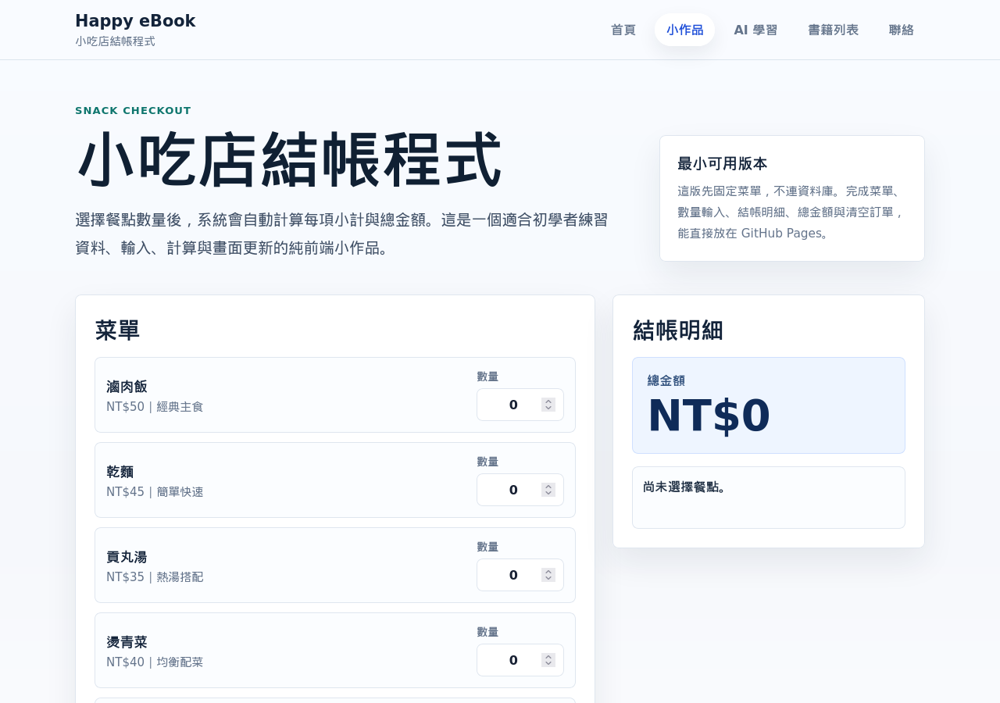
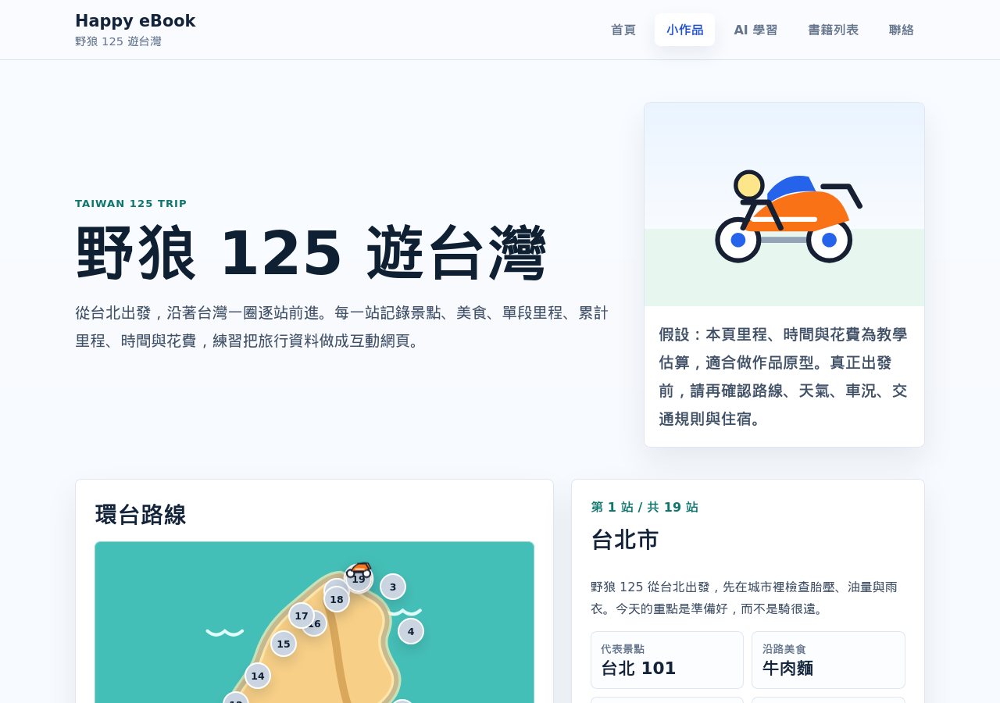
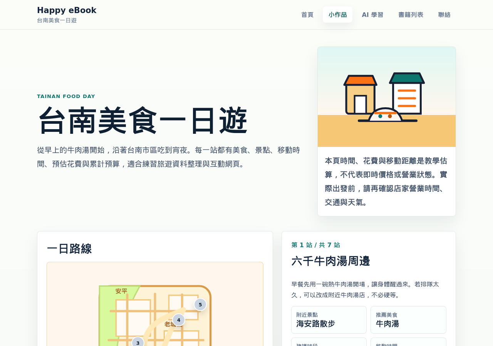
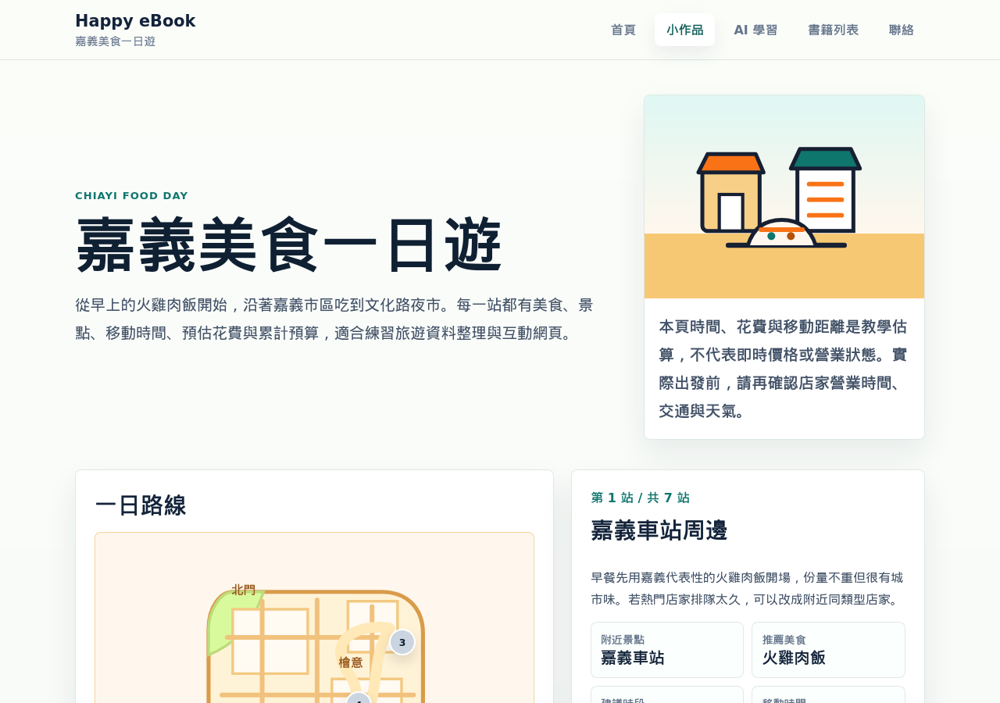
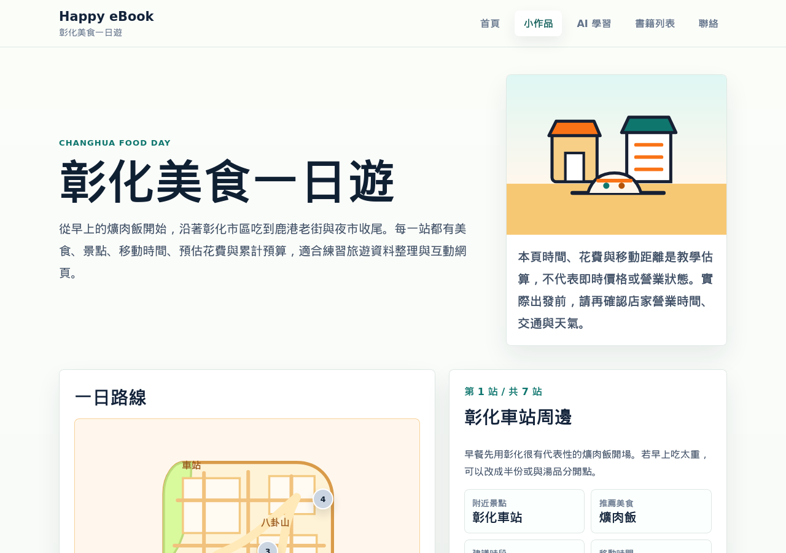
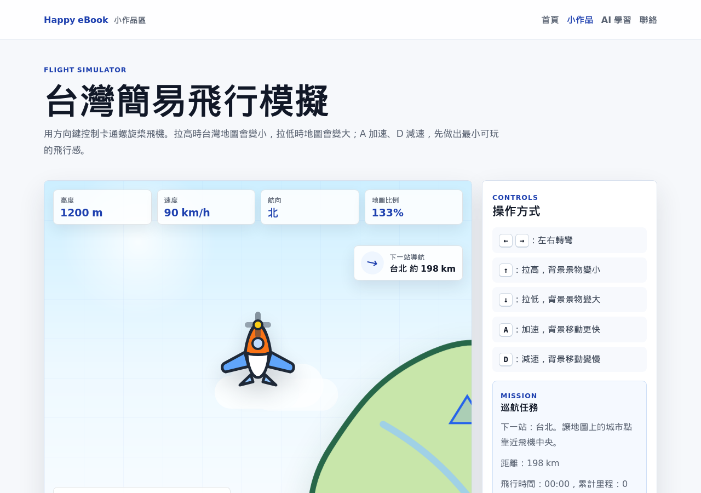
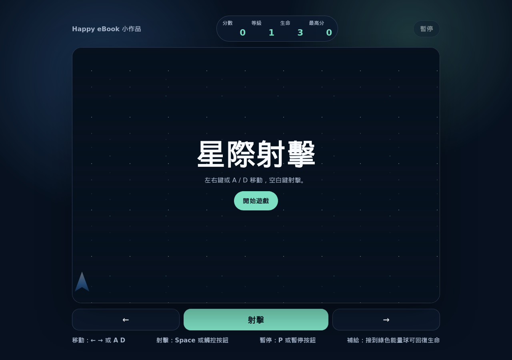
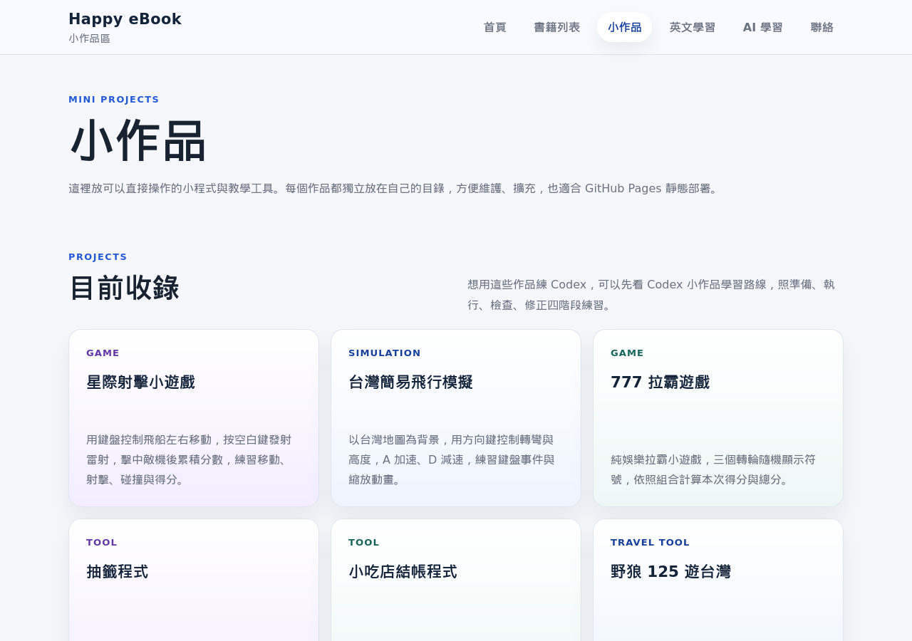

# 用 Codex 做出 10 個小作品 2

副標：地圖、動畫、穿搭、任務代理與飛行模擬實作入門

作者：Happy eBook

## 使用說明

這本書是《用 Codex 做出 10 個小作品》的第二本。第一本先用故事書、英文練習、抽籤、賓果、井字遊戲、電子白板、打磚塊、拉霸與 3D 摩天輪，帶讀者建立「小任務、請 Codex 協作、自己檢查、再修正」的基本流程。

第二本會把這個流程再往前推一步。這次的作品會更接近真實可展示的小工具，包含結帳表單、旅遊地圖、城市美食行程、四季動畫、穿搭學習、飛行模擬、射擊遊戲與任務代理產生器。

本書仍然維持初學者友善的限制：

- 使用 HTML、CSS、Vanilla JavaScript。
- 優先支援 GitHub Pages 靜態部署。
- 不需要後端伺服器。
- 不引入 React、Vue、Next.js 等大型框架。
- 每次修改都控制在可檢查的小範圍。

你不需要先背完整語法。更重要的是學會把需求說清楚，讓 Codex 做出第一版，再用人工檢查清單找出問題，最後請 Codex 小步修正。

### 這本書適合誰

這本書適合已經讀過第一本，或已經做過幾個簡單網頁作品，想繼續練習 Codex 協作流程的讀者。它也適合自學者、教師、家長與課程設計者，用來示範如何把一個想法拆成小作品，再逐步完成。

如果你已經有一點 HTML、CSS、JavaScript 經驗，可以把這本書當成 AI coding 工作流練習。你會看到如何寫需求、限制修改範圍、檢查結果、修正問題，以及把小作品整理成作品集。

這本書不適合想一次學完整前端框架、後端資料庫、會員系統、付款系統或大型軟體架構的讀者。本書的重點是純前端、靜態部署、小步實作與可檢查成果。

## 本書使用的 10 個小作品

1. 小吃店結帳程式
2. 野狼 125 遊台灣
3. 台南美食一日遊
4. 嘉義美食一日遊
5. 彰化美食一日遊
6. 水墨畫中的四季流轉
7. Office Lady 穿搭學習
8. 台灣簡易飛行模擬
9. 星際射擊小遊戲
10. Hermes Agent 任務代理產生器

## 線上小作品連結

1. 小吃店結帳程式：https://happyebook.com/mini-projects/snack-checkout/
2. 野狼 125 遊台灣：https://happyebook.com/mini-projects/scooter-taiwan/
3. 台南美食一日遊：https://happyebook.com/mini-projects/tainan-food-day/
4. 嘉義美食一日遊：https://happyebook.com/mini-projects/chiayi-food-day/
5. 彰化美食一日遊：https://happyebook.com/mini-projects/changhua-food-day/
6. 水墨畫中的四季流轉：https://happyebook.com/mini-projects/ink-seasons-tree/
7. Office Lady 穿搭學習：https://happyebook.com/mini-projects/office-outfit/
8. 台灣簡易飛行模擬：https://happyebook.com/mini-projects/taiwan-flight/
9. 星際射擊小遊戲：https://happyebook.com/mini-projects/star-shooter/
10. Hermes Agent 任務代理產生器：https://happyebook.com/mini-projects/hermes-agent/

## 全書共同流程

每一章都會盡量使用同一套流程：

1. 先看作品目標。
2. 看這章要學什麼。
3. 確認檔案位置。
4. 複製第一次可以給 Codex 的 prompt。
5. 看 Codex 可能會修改哪些地方。
6. 用檢查清單確認結果。
7. 發現問題後，用修正 prompt 小步修正。
8. 做一個延伸練習。

這套流程看起來重複，但對初學者很有幫助。因為學 AI coding 的重點不是一次叫 AI 做出很大的東西，而是把每一次修改變成自己看得懂、檢查得到、修得回來的小任務。

## 開始前你需要準備什麼

開始做第二組小作品前，請先準備一個可以安心練習的資料夾。你不需要一開始就懂完整網站架構，但至少要知道自己正在改哪一個檔案。

建議準備：

- 一個可以編輯 HTML、CSS、JavaScript 的文字編輯器。
- 一個可以打開本機網頁的瀏覽器。
- 一個已經可以使用 Codex 的工作環境。
- 一個靜態網站專案資料夾，例如 GitHub Pages 專案。
- 一份可以回復的版本紀錄，例如 Git commit。

如果你還沒有自己的網站，也可以先把每個作品當成獨立資料夾練習。重點不是一開始就部署成功，而是先完成「打開頁面、操作功能、檢查結果」這三件事。

本書的 prompt 會出現很多檔案路徑，例如：

```text
mini-projects/snack-checkout/index.html
```

如果你的資料夾名稱不同，請先把 prompt 裡的路徑改成自己的路徑。初學者最常見的卡關，不是程式邏輯太難，而是 Codex 改到錯的檔案，或檔案根本不在指定位置。

每一章的 prompt 通常可以分成兩種用法：

1. 如果你還沒有這個作品，就使用「建立」或「第一次可以給 Codex 的 prompt」。
2. 如果你已經有初版，就使用「請檢查」或「修正 prompt」。

不要急著一次貼很多段 prompt。建議一次只做一段，完成後先打開頁面檢查，再決定下一步。

如果你看不懂全部 JavaScript，先不要緊張。第一輪只要能照著 prompt 做出作品、知道怎麼檢查，就已經達到本書的主要目標。等你重複做幾個作品後，會慢慢看出資料、事件、狀態和畫面更新之間的關係。

## 有程式經驗的讀者可以先抓住三件事

如果你已經寫過一些程式，讀這本書時可以把重點放在三件事：資料、render、事件。

第一是資料。很多小作品其實都是一份資料加上一個目前狀態。例如旅遊作品有站點陣列，穿搭作品有場合資料，四季動畫有季節資料，遊戲有玩家、子彈、敵人與分數。資料設計清楚，後面請 Codex 修改時就比較不容易亂。

第二是 render。當資料或狀態改變時，畫面應該集中由一個更新流程產生，而不是到處手動改 DOM。簡化後可以想成：

```js
function render() {
  const item = data[currentIndex];
  title.textContent = item.title;
  description.textContent = item.description;
}
```

這段程式不是每章都要照抄，而是一個觀念：狀態改變後，呼叫同一個更新畫面的函式。這樣比較容易檢查，也比較容易修正。

第三是事件。按鈕、輸入欄、鍵盤操作都只是改變狀態的入口。例如下一站按鈕讓 `currentIndex` 加 1，季節按鈕改變 `currentSeason`，方向鍵改變飛機航向。事件處理不要塞太多畫面細節，最好讓它負責「改狀態」，再交給 `render()` 更新畫面。

你可以用這個角度讀後面每一章：

```text
資料是什麼？
目前狀態是什麼？
事件會怎麼改狀態？
render 會怎麼把狀態畫到畫面上？
```

如果你想把單檔作品整理得更工程化，可以等第一版穩定後再拆檔：

```text
index.html  → 頁面結構
style.css   → 外觀與手機版
data.js     → 站點、場合、季節等資料
script.js   → 事件、狀態與 render
```

初學階段用單檔比較容易跟著做；作品長大後再拆檔，會比較好維護。

## 第 1 章：第二本怎麼學

### 1.1 這本書和第一本有什麼不同

第一本的重點是讓你先做出 10 個可操作的小作品，建立「我真的能和 Codex 一起完成作品」的信心。第二本則會多練習幾種常見互動：

- 表單與計算。
- 站點資料切換。
- 地圖與路線視覺。
- 圖片與狀態切換。
- 鍵盤控制與遊戲迴圈。
- Prompt 產生器與任務代理格式。

這些作品不追求大型系統，也不追求炫技。它們的共同目標是讓你練習一件事：把一個模糊想法拆成可以請 Codex 執行的小任務。

第一本比較像「先把手感做出來」。你會知道怎麼請 Codex 建立頁面、加按鈕、修版面、檢查連結。第二本則開始接近真實作品維護：你會遇到資料越來越多、畫面狀態越來越多、互動規則越來越多的情況。

例如「小吃店結帳程式」看起來只是輸入數量與算錢，但它其實會碰到很多基本觀念：輸入欄讀到的是文字，不是數字；數量可能是空白；總金額要跟著每次輸入更新；手機版表格可能太寬。這些問題都很小，但它們正是真實寫網頁時常見的問題。

再看「台灣簡易飛行模擬」。它不只是畫一台飛機，而是把鍵盤事件、速度、高度、背景縮放、城市任務與到站紀錄串在一起。這類作品適合用 Codex 協作，因為你可以一次只請它完成一小段功能，再逐步加上下一段。

所以第二本的學習重點可以用一句話記住：

```text
不要一次叫 Codex 做完整大作品，而是把作品切成一個一個可檢查的小功能。
```

### 1.2 第二本的固定 prompt 骨架

後面每章都可以從這個 prompt 開始調整：

```text
請修改或建立 [檔案或資料夾]。

目標：
[用一句話說明這次要完成什麼小作品或小功能]

限制：
1. 使用 HTML、CSS、Vanilla JavaScript。
2. 不加後端。
3. 不引入大型框架。
4. 優先支援 GitHub Pages 靜態部署。
5. 手機版要能閱讀與操作。

功能：
1. [功能一]
2. [功能二]
3. [功能三]

完成後請檢查：
1. 頁面能正常開啟。
2. 主要操作流程可用。
3. 手機版沒有明顯重疊或超出畫面。
4. JavaScript 沒有語法錯誤。
5. 連結與圖片路徑正確。
```

這個骨架可以幫你把需求講清楚，也能限制 Codex 不要一次加入太多不必要的工具。

你可以注意這個 prompt 有幾個固定部分。

第一是「檔案或資料夾」。初學者常常只說「幫我改這個網站」，但 Codex 如果不知道要改哪裡，可能會花很多時間搜尋，也可能改到你不想改的檔案。比較好的做法是直接指出範圍，例如：

```text
請只修改 mini-projects/snack-checkout/index.html。
```

第二是「限制」。這個專案的重點是靜態網站，所以要明確說不要加後端、不要引入大型框架。這不是因為框架不好，而是因為初學階段最重要的是可理解、可部署、可檢查。

第三是「完成後請檢查」。Codex 可以幫忙跑語法檢查、看 Git diff、啟動本機伺服器，但最後仍然要由你確認畫面是否符合需求。AI 可以幫你寫程式，不能替你定義什麼叫好用。

### 1.3 把大需求拆小

如果你想做「台灣旅遊互動網站」，這個需求太大。你可以先拆成：

1. 先做一個靜態頁面，有標題與地圖。
2. 加上站點資料陣列。
3. 加上一站、下一站按鈕。
4. 顯示目前站點資料。
5. 計算累計里程與花費。
6. 修手機版。

每一步都很小，所以比較容易檢查。如果第 4 步壞掉，你知道問題大概在站點切換，不會懷疑整個網站都錯了。

這也是用 Codex 學程式時很重要的觀念：你不是把工作全部丟給 AI，而是把 AI 當成會幫忙的同學。你負責說清楚目標、檢查結果、決定下一步。

### 1.4 做完後一定要人工檢查

Codex 說完成，不代表真的完成。你至少要檢查：

- 能不能打開頁面。
- 按鈕是否真的有反應。
- 文字是否被圖片或卡片擋住。
- 手機版是否可閱讀。
- 有沒有舊作品複製後留下來的錯字。
- 是否不小心引入後端或大型框架。

如果你不知道怎麼檢查，可以先用這個順序：

1. 先看畫面能不能打開。
2. 再按每一個主要按鈕。
3. 改幾個輸入數字或選項。
4. 把瀏覽器縮到手機寬度。
5. 看文字、圖片、按鈕有沒有重疊。
6. 最後再看程式檢查結果。

不要只看桌機大螢幕。很多小作品在桌機看起來正常，手機版才會出現文字擠在一起、圖片裁切、按鈕太小等問題。

### 1.5 常見錯誤：一次要求太多

初學者常常會寫這種 prompt：

```text
幫我做一個完整旅遊平台，要有地圖、會員、資料庫、評論、後台、付款。
```

這種需求太大，而且不符合本書的靜態網站限制。比較好的寫法是：

```text
請建立一個純前端旅遊小作品。
先只做 5 個站點資料、上一站/下一站按鈕、目前站點卡片與累計花費。
不要加會員、資料庫或後端。
```

你會發現第二個 prompt 比較不華麗，但更容易成功。小作品的核心不是功能多，而是每個功能都能被看見、被理解、被檢查。

### 1.6 本章延伸練習

請你先打開第二組 10 個小作品，快速瀏覽每個作品的第一個畫面。不要急著改程式，只要先觀察：

- 哪些作品是表單工具？
- 哪些作品是地圖資料？
- 哪些作品是動畫？
- 哪些作品是遊戲？
- 哪些作品是 Prompt 工具？

這會幫助你理解後面章節的順序。

讀到這裡時，你可以先把第二組作品想成一條學習路線：先做表單工具，再做地圖資料，接著做視覺狀態，最後進入遊戲互動與 Prompt 工具。這樣後面每章會更容易接起來。

## 第 2 章：小吃店結帳程式

### 2.1 作品目標

建立一個可輸入餐點數量、計算小計與總金額的小吃店結帳頁。

這個作品很適合作為第二本的第一個實作，因為它不像遊戲那麼複雜，但已經包含真實互動：使用者輸入數量，畫面要立刻算出結果。它可以幫你練習三個基礎觀念：資料、畫面、事件。

資料是餐點名稱與單價。畫面是餐點列表、數量輸入框、小計與總金額。事件是使用者改變數量時，JavaScript 要重新計算。

這三個觀念會一直出現在後面的作品。美食一日遊會有站點資料，穿搭工具會有場合資料，飛行模擬會有高度與速度資料。先從結帳程式開始，會比較容易理解後面更大的互動。

### 2.2 這章要學什麼

- 表單輸入。
- 數字轉換。
- 小計與總計。
- 清除按鈕。
- 手機版表格閱讀。

這章最重要的觀念是：瀏覽器從輸入框讀到的值通常是文字。即使使用者輸入 `2`，JavaScript 讀到的也可能是字串 `"2"`。如果沒有轉成數字，後面的計算可能會出錯。

例如：

```js
"2" + 10
```

結果可能不是 `12`，而是 `"210"`。所以結帳程式要明確把輸入值轉成數字，常見做法是使用 `Number()` 或 `parseInt()`。對初學者來說，不需要一次記住所有差異，只要先記得：要計算前，先確認資料是數字。

### 2.3 檔案位置

```text
mini-projects/snack-checkout/index.html
```

### 2.4 第一次可以給 Codex 的 prompt

```text
請建立一個純前端小吃店結帳程式。

限制：
使用 HTML、CSS、Vanilla JavaScript，不加後端，不引入框架。

功能：
1. 顯示餐點名稱與單價。
2. 讓使用者輸入每個餐點數量。
3. 自動計算每項小計與總金額。
4. 提供清除按鈕。
5. 手機版要能閱讀。

完成後請檢查頁面、手機版與主要計算流程。
```

這個 prompt 的範圍很清楚：只做結帳，不做會員、不做後台、不做付款，也不需要真的連接餐廳系統。這樣 Codex 比較容易產生可用的第一版。

如果你的專案裡已經有 `mini-projects/snack-checkout/index.html`，可以把 prompt 改成：

```text
請修改 mini-projects/snack-checkout/index.html。
目標是補強小吃店結帳程式的計算流程與手機版閱讀。
請保留現有風格，不要重做整個網站。
```

「保留現有風格」很重要。當你已經有作品時，不一定要每次都叫 Codex 從零開始。很多時候更好的任務是小幅改進。

### 2.5 Codex 可能會修改哪些地方

- HTML：餐點列表、數量輸入欄、總金額區塊。
- CSS：表格或卡片版面、手機版排列。
- JavaScript：讀取數量、計算小計、更新總金額、清除數量。

如果 Codex 修改的是單一 HTML 檔，你可能會看到 HTML、CSS、JavaScript 都在同一個檔案裡。這對小作品來說可以接受，因為讀者不用在多個檔案之間跳來跳去。

但你仍然要能分辨三種內容：

- HTML 負責結構，例如餐點名稱、輸入框、按鈕。
- CSS 負責外觀，例如間距、顏色、手機版排列。
- JavaScript 負責行為，例如讀取數量、計算金額、清除表單。

當作品出錯時，先判斷是哪一類問題。畫面很醜通常是 CSS；按鈕沒反應通常是 JavaScript；文字或欄位少了通常是 HTML 或資料內容。

### 2.6 完成後怎麼檢查

- 數量輸入 1，總金額要增加。
- 數量輸入 0，該項小計應為 0。
- 清除後，所有數量與總金額要歸零。
- 手機版不能超出畫面。

建議你用下面這張小表檢查：

| 測試項目 | 操作 | 預期結果 |
|---|---|---|
| 單一品項 | 把滷肉飯數量改成 1 | 小計等於單價 |
| 多個品項 | 兩種餐點各輸入數量 | 總金額等於所有小計加總 |
| 空白輸入 | 把數量清空 | 不應出現 NaN |
| 清除按鈕 | 按清除 | 所有數量與總金額歸零 |
| 手機版 | 縮小瀏覽器寬度 | 表格或卡片不超出畫面 |

`NaN` 是 JavaScript 的一種結果，意思是「不是一個數字」。如果你在畫面上看到 `NaN`，通常代表程式拿到空白、無效字串，卻拿去做計算。這時可以請 Codex 加上預設值，例如空白時當成 0。

下圖是小吃店結帳程式的完成畫面。看圖時，請先觀察左側餐點與數量輸入，再看右側結帳明細如何同步更新總金額。



### 2.7 發現問題時怎麼請 Codex 修正

```text
小吃店結帳程式目前有問題：
[描述你看到的問題]

請只修改 mini-projects/snack-checkout/index.html。
不要新增框架，不要改其他作品。
修正後請說明你改了哪裡，以及我應該怎麼檢查。
```

請注意「不要改其他作品」這句很重要。當專案裡有很多小作品時，修一個結帳程式，不應該順手改到飛行模擬或穿搭工具。範圍越清楚，越不容易產生額外風險。

如果你看到總金額變成 `NaN`，可以這樣寫：

```text
小吃店結帳程式目前有問題：
當我把數量欄位清空時，總金額會顯示 NaN。

請只修改 mini-projects/snack-checkout/index.html。
請把空白或無效數量視為 0。
不要重做整個頁面，也不要改其他作品。
修正後請說明我要怎麼測試。
```

如果你看到手機版表格超出畫面，可以這樣寫：

```text
小吃店結帳程式在手機版會橫向超出畫面。

請只調整 mini-projects/snack-checkout/index.html 的版面。
可以把表格改成手機版卡片排列，但不要改變計算邏輯。
完成後請說明手機版檢查方式。
```

### 2.8 延伸練習

新增一個「服務費 10%」切換選項，讓使用者可以決定是否加入服務費。

你可以用這個 prompt：

```text
請在小吃店結帳程式新增「服務費 10%」切換選項。

要求：
1. 使用者勾選後，總金額加上 10% 服務費。
2. 取消勾選後，恢復原本總金額。
3. 畫面要清楚顯示餐點小計、服務費與應付總額。
4. 手機版仍然可閱讀。

請只修改 mini-projects/snack-checkout/index.html。
```

完成後請你自己檢查一個簡單例子：如果餐點總額是 100 元，勾選服務費後，應付總額應該是 110 元。先用這種容易心算的數字測試，比較容易看出程式是否正確。

## 第 3 章：野狼 125 遊台灣

### 3.1 作品目標

建立一個從台北出發、繞台灣一圈、逐站顯示景點與美食的互動頁。

這個作品比小吃店結帳程式多了一個重要概念：資料不是只有一列，而是一整段旅程。每一站都有縣市、景點、美食、里程、時間、花費與地圖位置。使用者按「下一站」時，畫面不是只改一個數字，而是要把一整組資料換掉。

你可以把這個作品想成一本會互動的旅遊小冊子。讀者不需要一次看到所有資料，而是沿著路線一站一站看。這樣的設計很適合初學者練習「用資料驅動畫面」。

這章的目標不是做出真實導航，也不是精準估算機車環島成本。它的目標是練習把旅遊資料整理成陣列，並讓畫面跟著目前站點更新。

### 3.2 這章要學什麼

- 用陣列保存旅遊站點。
- 用目前索引切換站點。
- 顯示累計里程、時間與花費。
- 讓地圖、路線與目前站點同步。

站點資料通常會長得像這樣：

```js
const stops = [
  {
    city: "台北",
    spot: "大稻埕",
    food: "滷肉飯",
    distance: 0,
    hours: 0,
    cost: 120
  },
  {
    city: "宜蘭",
    spot: "礁溪",
    food: "蔥油餅",
    distance: 55,
    hours: 2,
    cost: 180
  }
];
```

實際作品的資料會更完整，但觀念一樣：每一站都是一個物件，所有站點放在一個陣列裡。當目前站點是第 3 站，就讀取陣列中的第 3 筆資料，然後把畫面更新成那一站。

累計里程也可以用同一個資料陣列計算。例如目前到第 5 站，就把第 1 到第 5 站的里程加總。這比手動寫死每一站累計數字更好維護。

### 3.3 檔案位置

```text
mini-projects/scooter-taiwan/index.html
```

### 3.4 第一次可以給 Codex 的 prompt

```text
請建立「野狼 125 遊台灣」純前端小作品。

功能：
1. 從台北出發，繞台灣一圈，再回台北。
2. 每一站顯示縣市、重要景點、美食、單段里程、累計里程、時間與花費。
3. 地圖上顯示目前站點。
4. 提供上一站、下一站按鈕。

限制：
使用 HTML、CSS、Vanilla JavaScript，不加後端，不引入框架。
```

如果作品已經存在，建議不要叫 Codex 重新建立整頁，而是請它「補強」或「修正」。例如：

```text
請檢查 mini-projects/scooter-taiwan/index.html。

目標：
讓目前站點、地圖標記、美食圖與累計里程保持同步。

限制：
不要重做整個頁面，不要引入框架，不要改其他小作品。
完成後請說明如何測試每一站資料是否正確。
```

這種寫法會讓 Codex 更像在維護現有作品，而不是推倒重來。

### 3.5 Codex 可能會修改哪些地方

- 站點資料陣列。
- 地圖標記。
- 目前站點卡片。
- 累計數字計算。
- 上一站與下一站事件。

這裡最容易出錯的是「資料和畫面不同步」。例如畫面卡片已經切到台南，但地圖標記還停在台中；或美食圖已經換了，但累計里程沒有更新。

遇到這種情況時，先不要急著改 CSS。你應該先問：目前站點的資料來源是不是同一個？比較好的做法是讓畫面上所有資訊都從同一個 `currentIndex` 或目前站點資料產生。

簡化邏輯可以這樣想：

```text
目前站點索引 currentIndex
→ 找出 stops[currentIndex]
→ 更新城市、景點、美食、地圖標記、累計數字
```

如果每個區塊各自用不同變數，就比較容易不同步。

### 3.6 完成後怎麼檢查

- 下一站按鈕能逐站前進。
- 回到台北時，累計里程、時間、花費都有完整數字。
- 美食圖或提示會跟著目前站點切換。

你可以用這張檢查表：

| 測試項目 | 操作 | 預期結果 |
|---|---|---|
| 起點 | 打開頁面 | 顯示台北或第一站 |
| 下一站 | 按下一站 | 城市、景點、美食、地圖標記一起更新 |
| 上一站 | 按上一站 | 回到前一站，累計數字也回到前一站 |
| 最後一站 | 一直按到最後 | 能回到台北或完成環島 |
| 手機版 | 縮小畫面 | 地圖、文字、按鈕不重疊 |

檢查時不要只看第一站。很多錯誤會出現在中間站或最後一站，特別是陣列索引超出範圍時，畫面可能會空白或出現 `undefined`。

下圖是野狼 125 遊台灣的主要畫面。看圖時，請注意資料切換不只是文字變化，也包含地圖、縮圖、美食與累計資訊同步更新。



### 3.7 修正 prompt

```text
目前野狼 125 遊台灣的 [地圖/站點/里程/美食圖] 有問題。
請只修正 mini-projects/scooter-taiwan/index.html。
不要重做整頁，先找出原因，再小範圍修改。
```

如果是美食圖沒有跟著站點變，可以寫得更具體：

```text
目前野狼 125 遊台灣有一個問題：
我按下一站後，文字已經切到新縣市，但右下角美食圖沒有跟著更新。

請只修改 mini-projects/scooter-taiwan/index.html。
請檢查目前站點資料、圖片切換邏輯與 render 函式。
不要重做整頁，也不要改其他小作品。
完成後請說明我要怎麼測試。
```

如果是藍色路線沒有跟上，可以寫：

```text
目前野狼 125 遊台灣的藍色路線沒有跟上目前站點。

請只修正路線顯示與目前站點同步問題。
不要改旅遊資料，不要重做地圖。
完成後請列出我應該檢查哪幾站。
```

### 3.8 延伸練習

新增「目前天氣感覺」欄位，例如晴天、海風、山路、夜市人潮。

延伸練習可以用這個 prompt：

```text
請在野狼 125 遊台灣每一站新增「天氣感覺」欄位。

要求：
1. 每站資料加入 weatherNote。
2. 目前站點卡片顯示天氣感覺。
3. 文案要短，適合旅遊頁面。
4. 不要改變原本里程、時間與花費計算。

請只修改 mini-projects/scooter-taiwan/index.html。
```

完成後要檢查：每一站都有天氣感覺，而且不會讓卡片變得太擠。手機版如果文字太多，可以請 Codex 把天氣感覺放在比較小的提示區。

## 第 4 章：台南美食一日遊

### 4.1 作品目標

建立一個台南美食一日遊互動頁，從早餐、午餐、點心、晚餐到宵夜，逐站顯示行程。

這個作品和「野狼 125 遊台灣」很像，都是站點資料切換，但它的思考方式不同。環島作品重點是「順著地圖走一圈」，台南美食一日遊重點是「一天怎麼吃得順」。

所以路線不一定要排成直線，也不一定要永遠往同一個方向前進。真實一日遊常常會考慮早餐店營業時間、午餐排隊、下午點心、晚餐與夜市。這章要練習的是：資料不只是一串地點，也包含時間、需求與情境。

這個觀念很重要。當你用 Codex 做作品時，不是只把資料塞進網頁，而是要先想清楚使用者要怎麼看、怎麼用。

### 4.2 這章要學什麼

- 城市一日遊資料設計。
- 時段、站點、美食與預算。
- 地圖上不必直線前進的路線安排。
- 手機版資訊距離與閱讀順序。

台南美食一日遊的站點資料可以包含：

```js
{
  time: "08:00",
  period: "早餐",
  place: "國華街周邊",
  food: "牛肉湯",
  budget: 180,
  note: "早上先吃熱湯，行程不要排太趕。"
}
```

和環島作品相比，這裡多了 `time` 和 `period`。這代表使用者不是只看地理順序，也會看一天的時間節奏。

台南美食一日遊也適合練習「資料欄位命名」。例如 `food` 比 `thing` 清楚，`budget` 比 `money` 更像預算，`period` 可以表示早餐、午餐、晚餐或點心。命名清楚，後面請 Codex 修改時也比較容易溝通。

### 4.3 檔案位置

```text
mini-projects/tainan-food-day/index.html
```

### 4.4 第一次可以給 Codex 的 prompt

```text
請建立「台南美食一日遊」純前端小作品。

功能：
1. 安排早餐、午餐、晚餐與點心。
2. 每站顯示時間、地點、美食、預算與移動說明。
3. 用台南地圖風格呈現站點。
4. 提供上一站、下一站與站點按鈕。

限制：
使用 HTML、CSS、Vanilla JavaScript，不加後端。
```

如果你已經有一個美食一日遊頁面，也可以請 Codex 針對資料品質修正：

```text
請檢查 mini-projects/tainan-food-day/index.html。

目標：
讓台南美食一日遊的早餐、午餐、晚餐與點心安排更清楚。

要求：
1. 每站要有時間、地點、美食、預算與簡短說明。
2. 路線不必排成同一直線，可以依一日行程合理安排。
3. 手機版下一站資訊不要離路線太遠。
4. 不要引入框架或後端。
```

這個 prompt 特別提到「路線不必排成同一直線」，是因為很多初學者會以為地圖上的點一定要排得很整齊。但旅遊行程的重點不是畫出漂亮直線，而是讓讀者理解下一站要去哪裡、為什麼這樣安排。

### 4.5 完成後怎麼檢查

- 每個時段都有食物安排。
- 站點順序合理，但不必硬排成直線。
- 手機版下一站資訊不要離路線太遠。

建議用下面的方式檢查：

| 測試項目 | 操作 | 預期結果 |
|---|---|---|
| 時段完整 | 看所有站點 | 早餐、午餐、晚餐、點心都有出現 |
| 預算累計 | 切換到不同站 | 累計預算跟著目前站點更新 |
| 地圖站點 | 點不同站 | 地圖上的目前站點有明顯提示 |
| 下一站資訊 | 手機版查看 | 下一站資訊和路線區塊距離合理 |
| 文案長度 | 看每張卡片 | 說明短而清楚，不會擠爆卡片 |

這章特別要注意手機版。桌機版可能地圖在左、資訊在右，看起來很舒服；但手機版通常會變成上下排列。如果下一站資訊離地圖太遠，使用者會不知道自己按了按鈕後畫面哪裡變了。

遇到這種問題，可以請 Codex 把目前站點摘要放在地圖下方，或讓下一站卡片更靠近路線圖。

下圖是台南美食一日遊的完成畫面。看圖時，請注意地圖和行程卡片之間的距離，使用者切換站點後應該很快看出目前行程的變化。



### 4.6 修正 prompt

如果手機版資訊太遠，可以用：

```text
台南美食一日遊手機版有一個問題：
下一站資訊離一日路線太遠，使用者按下一站後不容易看到變化。

請只修改 mini-projects/tainan-food-day/index.html。
請調整手機版版面，讓目前站點與下一站資訊更靠近路線圖。
不要改資料內容，不要重做整頁。
```

如果地圖不像台南或太抽象，可以用：

```text
台南美食一日遊的地圖視覺太抽象。

請只調整 mini-projects/tainan-food-day/index.html 的地圖區塊。
目標是讓地圖更像台南市區導覽圖，但仍保持簡化卡通風格。
不要引入外部地圖服務，不要加後端。
```

### 4.7 延伸練習

新增「預算模式」切換：省錢、一般、吃好一點。

可以使用這個 prompt：

```text
請在台南美食一日遊新增「預算模式」切換。

模式：
1. 省錢
2. 一般
3. 吃好一點

要求：
1. 切換模式後，每站預算與總預算會更新。
2. 不需要改變所有站點，只要讓預算數字與建議文字跟著模式變化。
3. 手機版切換按鈕要容易點。
4. 不要引入框架或後端。

請只修改 mini-projects/tainan-food-day/index.html。
```

這個延伸練習會讓作品更像真實旅遊工具。你會開始練習同一份行程資料，在不同模式下呈現不同預算與建議。這也是後面做嘉義、彰化版本時可以重複使用的設計。

## 第 5 章：嘉義美食一日遊

### 5.1 作品目標

以台南美食一日遊為範本，建立嘉義版本。

這一章開始練習一個很實用的 AI coding 技巧：不是從零開始，而是用已經完成的作品當範本。台南美食一日遊已經有行程卡片、站點切換、地圖視覺、預算顯示與手機版版面，所以做嘉義版本時，不需要重新發明整個架構。

這種做法很像真實工作中的「複製一個功能，改成另一個情境」。重點不是複製，而是複製後能不能整理乾淨。最常見的問題是：標題改成嘉義了，但 SEO 描述還寫台南；站點改成嘉義了，但地圖 alt 文字還是台南；首頁卡片新增了，但 sitemap 忘記更新。

所以本章目標不是只做出嘉義頁，而是學會一套範本複製檢查流程。

### 5.2 這章要學什麼

- 用既有作品當模板。
- 替換城市資料。
- 保留互動邏輯。
- 檢查複製後是否殘留舊文字。

範本複製時可以把內容分成兩類：

第一類是要保留的東西：

- 頁面基本結構。
- 上一站、下一站、站點按鈕。
- 累計預算計算。
- 手機版版面。
- 回到小作品首頁的連結。

第二類是要替換的東西：

- 頁面標題。
- meta description、canonical、OG title。
- 城市名稱。
- 站點資料。
- 美食名稱。
- 地圖外形或地圖標記。
- 小作品首頁卡片文字。

你可以把這章想成「練習改資料，不亂改邏輯」。如果台南版的切換邏輯已經能用，嘉義版最好保留同一套邏輯，只改資料和文案。這樣比較穩，也比較容易檢查。

### 5.3 檔案位置

```text
mini-projects/chiayi-food-day/index.html
```

### 5.4 第一次可以給 Codex 的 prompt

```text
請以 mini-projects/tainan-food-day/ 為範本，新建 mini-projects/chiayi-food-day/。

目標：
做出「嘉義美食一日遊」。

請保留原本互動方式，但把標題、SEO、站點、美食、地圖與預算都改成嘉義。
完成後請檢查是否還殘留台南文字。
```

如果你要讓 Codex 更清楚，可以把任務拆成兩次。第一次先建立頁面：

```text
請以 mini-projects/tainan-food-day/ 為範本，新建 mini-projects/chiayi-food-day/。

先完成：
1. 複製頁面結構。
2. 改成嘉義美食一日遊。
3. 替換 title、description、canonical、OG 與頁面主標題。
4. 保留原本互動邏輯。

先不要新增複雜功能。
完成後請列出還需要替換的資料項目。
```

第二次再替換內容：

```text
請繼續修改 mini-projects/chiayi-food-day/index.html。

目標：
把站點資料、美食、預算、地圖標記與文案都改成嘉義。

請檢查是否還殘留「台南」兩個字。
不要改互動邏輯，不要引入框架或後端。
```

分兩次做的好處是比較容易抓錯。第一次確認頁面能開，第二次確認資料換乾淨。

### 5.5 完成後怎麼檢查

- 頁面標題是嘉義。
- 所有站點都是嘉義相關。
- 小作品首頁可以連到嘉義頁。

建議檢查清單：

| 檢查項目 | 怎麼檢查 | 預期結果 |
|---|---|---|
| 頁面標題 | 看瀏覽器標題與 h1 | 都是嘉義美食一日遊 |
| SEO | 搜尋 title、description、canonical | 連結與文案都指向嘉義 |
| 舊字殘留 | 搜尋「台南」 | 不應出現在嘉義頁 |
| 站點資料 | 點每個站點 | 都是嘉義景點與美食 |
| 小作品首頁 | 打開 mini-projects/ | 有嘉義美食一日遊入口 |
| 返回連結 | 從嘉義頁點回小作品 | 能回到小作品首頁 |

如果你在本機專案中檢查，可以用搜尋工具找殘留文字：

```text
搜尋 mini-projects/chiayi-food-day/index.html 裡是否還有「台南」。
```

如果還有，要判斷它是不是故意提到「以台南為範本」。在正式作品頁中，通常不需要提範本來源，所以應該改掉。

下圖是嘉義美食一日遊的完成畫面。看圖時，請確認同一套範本換成不同城市後，標題、地圖、站點與食物都已經同步替換。



### 5.6 修正 prompt

如果發現嘉義頁還殘留台南文字，可以這樣請 Codex：

```text
嘉義美食一日遊頁面還殘留台南文字。

請只修改 mini-projects/chiayi-food-day/index.html。
請搜尋並檢查所有「台南」相關文字，改成嘉義內容。
注意 title、meta description、canonical、OG、h1、站點資料與頁尾連結。
不要改互動邏輯。
```

如果小作品首頁沒有入口，可以這樣寫：

```text
請把嘉義美食一日遊加入 mini-projects/index.html。

要求：
1. 新增一張小作品卡片。
2. 連結到 chiayi-food-day/。
3. 文案簡短說明嘉義美食一日遊。
4. 不要改其他小作品卡片內容。
```

如果 sitemap 沒有收錄，可以寫：

```text
請把 https://happyebook.com/mini-projects/chiayi-food-day/ 加入 sitemap.xml。
請保持 XML 格式正確，完成後檢查 sitemap 可以解析。
```

### 5.7 延伸練習

新增「火雞肉飯比較」小區塊，讓讀者看到不同選擇。

這個延伸練習可以讓嘉義頁更有自己的特色，而不只是把台南資料換成嘉義資料。可以使用這個 prompt：

```text
請在嘉義美食一日遊新增「火雞肉飯比較」小區塊。

要求：
1. 顯示 3 種火雞肉飯選擇。
2. 每個選擇包含特色、適合時段與預估價格。
3. 區塊風格要和原本頁面一致。
4. 手機版要能閱讀。
5. 不要改原本一日遊站點切換邏輯。

請只修改 mini-projects/chiayi-food-day/index.html。
```

完成後請檢查這個小區塊是不是「補充資訊」，不要讓它搶走主要行程的焦點。作品主線仍然是一日遊，不是火雞肉飯資料庫。

## 第 6 章：彰化美食一日遊

### 6.1 作品目標

再用美食一日遊模板，建立彰化版本。

第 5 章已經練習把台南範本改成嘉義。第 6 章再做一次彰化，是為了讓你熟悉「同系列作品」的維護方式。做一次可能只是照著提示完成；做第二次，你會開始看到共通結構。

台南、嘉義、彰化三個作品應該像同一系列：操作方式相似、版面邏輯相似、卡片結構相似，但內容各有城市特色。這就是同系列小作品的價值。讀者學會一個後，再打開另一個，不需要重新理解操作方式，只需要看新的城市資料。

彰化版本也適合加入「市區」與「鹿港」的差異。因為彰化美食常常不只在彰化市，也可能延伸到鹿港。這會讓你練習：同一個城市主題下，也可以有不同路線分支。

### 6.2 這章要學什麼

- 第二次複製模板。
- 觀察三個城市版本的共通結構。
- 修正手機版資訊距離。
- 建立同系列作品的一致風格。

做第二個城市範本時，最重要的是不要讓每一版越改越亂。你可以先整理一份共通檢查清單：

- 每頁都有相同的主導覽與返回小作品連結。
- 每頁都有同樣的上一站、下一站與站點按鈕。
- 每頁都有時段、地點、美食、預算與說明。
- 每頁都有自己的 title、description、canonical。
- 每頁都能在手機版閱讀。

接著再檢查城市差異：

- 台南要像台南。
- 嘉義要有嘉義特色。
- 彰化要有彰化與鹿港的食物記憶。

共通結構和城市特色都要保留，作品才會像一系列，而不是三個互相無關的頁面。

### 6.3 檔案位置

```text
mini-projects/changhua-food-day/index.html
```

### 6.4 第一次可以給 Codex 的 prompt

```text
請以「台南美食一日遊」為範本，新建「彰化美食一日遊」。

要求：
1. 保留美食一日遊互動架構。
2. 改成彰化景點、美食、時段與預算。
3. 檢查手機版下一站資訊與路線不要距離太遠。
4. 不要引入框架或後端。
```

如果你已經完成嘉義版，可以請 Codex 參考三者一致性：

```text
請建立 mini-projects/changhua-food-day/index.html。

參考：
1. mini-projects/tainan-food-day/index.html
2. mini-projects/chiayi-food-day/index.html

目標：
做出「彰化美食一日遊」，保留同系列互動與版面結構。

請改成彰化景點、美食、時段與預算。
完成後請檢查是否殘留台南或嘉義文字。
```

這個 prompt 比只說「以台南為範本」更進一步，因為它讓 Codex 知道你要建立的是同系列第三個作品。

### 6.5 完成後怎麼檢查

- 彰化頁能獨立開啟。
- 城市資料完整替換。
- 手機版路線與資訊區塊距離合理。

建議檢查方式：

| 檢查項目 | 操作 | 預期結果 |
|---|---|---|
| 獨立頁面 | 打開 changhua-food-day/ | 頁面正常顯示 |
| 舊字殘留 | 搜尋台南、嘉義 | 不應殘留在彰化頁 |
| 城市特色 | 看站點與美食 | 應符合彰化主題 |
| 操作一致 | 和台南、嘉義比較 | 上一站、下一站、站點切換方式一致 |
| 手機版 | 縮小畫面 | 地圖與資訊順序合理 |

彰化頁尤其要注意一件事：不要只把城市名稱替換成彰化，但食物和景點仍然像其他城市。使用者一眼就能看出資料是不是用心整理。即使只是教學範例，也要讓內容有基本可信度。

下圖是彰化美食一日遊的完成畫面。看圖時，請注意它和台南、嘉義版本保持同系列操作方式，但內容已經換成彰化自己的城市特色。



### 6.6 修正 prompt

如果彰化頁有舊城市殘留：

```text
彰化美食一日遊頁面中仍殘留台南或嘉義文字。

請只修改 mini-projects/changhua-food-day/index.html。
請檢查 title、meta description、canonical、OG、h1、站點資料、地圖文字與頁面文案。
不要改互動邏輯。
```

如果三個城市版面不一致：

```text
台南、嘉義、彰化三個美食一日遊頁面的版面不一致。

請只檢查 mini-projects/changhua-food-day/index.html。
目標是讓彰化頁的操作方式與台南、嘉義一致。
不要改城市資料，只調整版面與按鈕區塊。
```

如果手機版下一站資訊太遠：

```text
彰化美食一日遊手機版中，下一站資訊離路線太遠。

請只修改 mini-projects/changhua-food-day/index.html。
請調整手機版排版，讓地圖、目前站點與下一站資訊更接近。
不要重做整頁。
```

### 6.7 延伸練習

新增「鹿港支線」選項，讓行程可切換成市區版或鹿港版。

可以使用這個 prompt：

```text
請在彰化美食一日遊新增「路線模式」切換。

模式：
1. 彰化市區
2. 鹿港支線

要求：
1. 切換模式後，站點資料、地圖標記與預算會跟著改變。
2. 保留原本上一站、下一站操作。
3. 手機版切換按鈕要容易點。
4. 不要引入框架或後端。

請只修改 mini-projects/changhua-food-day/index.html。
```

這個延伸練習會比前面的資料替換更進一步。你不只是建立一條固定路線，而是讓同一個作品可以在兩套路線資料之間切換。這個技巧之後也能用在旅遊、學習路線、穿搭模式、遊戲關卡等作品中。

## 第 7 章：水墨畫中的四季流轉

### 7.1 作品目標

建立一個水墨風互動動畫，讓主圖在春、夏、秋、冬之間切換。

這一章開始從「資料型互動」進入「視覺狀態互動」。前面的旅遊作品主要是切換站點資料；水墨四季則是切換畫面氣氛。使用者按下春、夏、秋、冬，看到的不只是文字改變，而是整個畫面顏色、點綴、說明與狀態一起改變。

這類作品很適合練習「狀態」這個觀念。狀態可以是目前季節，也可以是目前穿搭場合、目前遊戲關卡、目前任務進度。只要你能掌握「目前狀態是什麼」，就能讓畫面跟著狀態更新。

本章的重點不是做很複雜的動畫，而是做出優雅、可控制、可檢查的四季切換。

### 7.2 這章要學什麼

- 圖片主視覺。
- CSS 狀態切換。
- JavaScript 切換季節。
- 動畫與文字提示。

四季狀態可以先整理成資料：

```js
const seasons = {
  spring: {
    label: "春",
    title: "新芽與花點",
    note: "枝頭出現柔和的新綠與淡花。"
  },
  summer: {
    label: "夏",
    title: "葉色變深",
    note: "樹影更濃，畫面帶一點盛夏的厚度。"
  }
};
```

真實作品會有春夏秋冬四個狀態。按下按鈕時，JavaScript 只要更新目前季節，再把對應文字、樣式 class 或圖片效果套到畫面上。

你可以把它想成：

```text
目前季節 currentSeason
→ 找出 seasons[currentSeason]
→ 更新按鈕、標題、說明、畫面效果
```

這個模式會在第 8 章穿搭學習再次出現，只是第 8 章的狀態從季節變成場合。

### 7.3 檔案位置

```text
mini-projects/ink-seasons-tree/index.html
```

### 7.4 第一次可以給 Codex 的 prompt

```text
請建立「水墨畫中的四季流轉」純前端小作品。

功能：
1. 以一張主圖為核心。
2. 提供春、夏、秋、冬四個按鈕。
3. 切換季節時，畫面色調、點綴與文字說明跟著改變。
4. 保持水墨畫風格，不要過度動畫。
```

如果作品已經有主圖，可以把 prompt 寫得更精準：

```text
請修改 mini-projects/ink-seasons-tree/index.html。

目標：
保留目前主圖，補強春夏秋冬四種狀態切換。

要求：
1. 四個季節按鈕都能切換。
2. 每個季節有不同標題、說明與畫面點綴。
3. 文字不要遮住主圖精華區域。
4. 動畫要柔和，不要太花。
5. 不要引入框架或後端。
```

這裡特別提醒「文字不要遮住主圖精華區域」，因為視覺型作品最容易發生的問題，就是功能有了，但畫面被文字或卡片擋住。對水墨畫作品來說，畫面本身就是主角，UI 應該輔助它，而不是搶走它。

### 7.5 完成後怎麼檢查

- 四個季節按鈕都能切換。
- 主圖沒有被文字遮住。
- 季節變化清楚但不刺眼。

建議檢查表：

| 檢查項目 | 操作 | 預期結果 |
|---|---|---|
| 春 | 按春 | 顯示春天標題與柔和新綠、花點感 |
| 夏 | 按夏 | 色調或葉色更深 |
| 秋 | 按秋 | 有秋意、落葉或暖色提示 |
| 冬 | 按冬 | 有冬天冷色、留白或雪點感 |
| 手機版 | 縮小畫面 | 按鈕與文字不遮住主圖 |
| 自動效果 | 等幾秒或切換狀態 | 動畫不會閃爍或過度搶眼 |

視覺型作品檢查時，不只要問「功能有沒有動」，也要問「畫面有沒有好看」。如果水墨畫被太多卡片、粗線條或高飽和顏色蓋住，就算功能正確，也不符合這個作品的氣質。

下圖是水墨畫中的四季流轉畫面。看圖時，請注意主圖、季節按鈕與文字提示如何一起呈現目前季節。


### 7.6 修正 prompt

如果文字遮住主圖，可以用：

```text
水墨畫中的四季流轉目前有一個問題：
季節文字或卡片遮住主圖精華區域。

請只修改 mini-projects/ink-seasons-tree/index.html。
請調整版面，讓主圖保持清楚，文字改放在不遮擋的位置。
不要重做整頁，不要引入框架。
```

如果四季按鈕切換不明顯，可以用：

```text
水墨畫中的四季流轉目前四季差異不夠明顯。

請只修改 mini-projects/ink-seasons-tree/index.html。
請讓春、夏、秋、冬在色調、點綴與說明文字上更容易分辨。
保持水墨畫風格，不要使用太鮮豔或太卡通的效果。
```

如果動畫太誇張，可以用：

```text
水墨畫中的四季流轉動畫太搶眼。

請降低動畫強度，讓切換更柔和。
可以減少移動幅度、降低透明度變化或延長過渡時間。
請保留春夏秋冬切換功能。
```

### 7.7 延伸練習

新增自動播放模式，每幾秒切換下一季。

可以使用這個 prompt：

```text
請在水墨畫中的四季流轉新增自動播放模式。

要求：
1. 提供「自動播放 / 暫停」按鈕。
2. 自動播放時，每 3 秒切換下一個季節。
3. 使用者手動點季節按鈕時，畫面要立刻切換。
4. 手機版按鈕要容易點。
5. 不要引入框架或後端。

請只修改 mini-projects/ink-seasons-tree/index.html。
```

這個練習會讓你接觸 `setInterval` 或類似的時間控制。要注意：自動播放不應該讓使用者失去控制，所以一定要有暫停按鈕。

## 第 8 章：Office Lady 穿搭學習

### 8.1 作品目標

建立一個穿搭學習工具，使用者依場合切換主圖與穿搭建議。

這個作品和第 7 章很像，都是狀態切換；差別在於第 7 章切換季節，第 8 章切換場合。場合一變，主圖、上衣、外套、鞋子、建議文字與分數都要一起變。

穿搭學習工具很適合練習「資料和圖片一起切換」。如果只換文字不換圖，使用者會覺得不直覺；如果只換圖不換建議，學習效果又不夠。真正的互動教學工具，要讓視覺和文字互相支持。

本章也會練習一件很實用的事：修正版面。穿搭頁最常見的問題不是邏輯錯，而是圖片被裁切、標籤壓到人物、按鈕在手機版太擠。這些都是前端作品很真實的檢查點。

### 8.2 這章要學什麼

- 狀態資料。
- 場合按鈕。
- 圖片切換。
- 穿搭理由與分數。

場合資料可以設計成這樣：

```js
const occasions = {
  daily: {
    label: "日常上班",
    image: "outfit-daily.png",
    top: "針織衫",
    outer: "開襟外套",
    shoes: "樂福鞋",
    note: "柔和、舒服，適合一般辦公日。"
  },
  meeting: {
    label: "重要會議",
    image: "outfit-meeting.png",
    top: "襯衫",
    outer: "西裝外套",
    shoes: "低跟鞋",
    note: "正式感較高，適合簡報或面談。"
  }
};
```

實際作品會有四種場合：日常上班、重要會議、下班約會、週五休閒。使用者按下場合按鈕時，程式要讀取對應資料，更新圖片、文字和建議。

這裡的重點和前一章一樣：

```text
目前場合 currentOccasion
→ 找出 occasions[currentOccasion]
→ 更新圖片、穿搭名稱、建議與分數
```

### 8.3 檔案位置

```text
mini-projects/office-outfit/index.html
```

### 8.4 第一次可以給 Codex 的 prompt

```text
請建立 Office Lady 穿搭學習小工具。

功能：
1. 提供日常上班、重要會議、下班約會、週五休閒四種場合。
2. 使用者點選場合時，主圖要切換。
3. 同步顯示上衣、外套、鞋子與穿搭建議。
4. 圖片完整顯示，不要讓標籤壓到人物。
```

如果你已經有四張圖片，可以要求更精準：

```text
請修改 mini-projects/office-outfit/index.html。

目標：
讓場合模式按鈕切換四張主圖。

圖片：
1. 日常上班：outfit-daily.png
2. 重要會議：outfit-meeting.png
3. 下班約會：outfit-date.png
4. 週五休閒：outfit-casual.png

要求：
1. 點選場合時，主圖、alt 文字、穿搭建議都要更新。
2. 圖片要完整顯示，不要裁切人物。
3. 標籤不要壓在人物腳上。
4. 手機版也要可閱讀。
```

這個 prompt 把圖片檔名列出來，可以降低 Codex 接錯圖片的機率。當作品有明確資產時，最好直接告訴 Codex 檔名與用途。

### 8.5 完成後怎麼檢查

- 四個場合都能切換。
- 主圖不被裁切。
- 建議文字與目前場合一致。

檢查表：

| 場合 | 預期圖片 | 預期感覺 |
|---|---|---|
| 日常上班 | cardigan / knit / loafers 類型 | 柔和、舒適 |
| 重要會議 | blazer / shirt / heels 類型 | 正式、俐落 |
| 下班約會 | trench / soft color 類型 | 下班後較柔和 |
| 週五休閒 | tee / cardigan / sneakers 類型 | 輕鬆、好活動 |

另外要特別檢查圖片版面：

- 人物頭部不能被裁掉。
- 鞋子不能被底部標籤蓋住。
- 圖片不要被拉伸變形。
- 文字不要塞在圖片裡太多。
- 手機版按鈕不要太小。

如果你看到圖片被裁切，通常是 `object-fit: cover` 或容器比例造成的。要完整顯示人物時，常常會改用 `object-fit: contain`，並調整容器高度。

下圖是 Office Lady 穿搭學習的完成畫面。看圖時，請特別注意「場合、圖片、穿搭名稱、建議文字」是否同步，這是本章最重要的檢查點。


### 8.6 修正 prompt

如果圖片被裁切：

```text
Office Lady 穿搭學習目前主圖被裁切，人物沒有完整顯示。

請只修改 mini-projects/office-outfit/index.html。
請調整圖片容器與 object-fit，讓人物完整顯示。
不要改四張圖片檔案，不要重做整頁。
```

如果標籤壓到人物：

```text
Office Lady 穿搭學習底部穿搭標籤壓到人物鞋子。

請只修改 mini-projects/office-outfit/index.html。
請把標籤移到圖片框外，或調整成不遮擋主圖的位置。
手機版也要檢查。
```

如果場合切換只換文字沒有換圖：

```text
Office Lady 穿搭學習目前點選場合時，文字會變，但主圖沒有跟著切換。

請只修改 mini-projects/office-outfit/index.html。
請檢查 occasions 資料、圖片 src 更新邏輯與按鈕事件。
四個場合都要切換到對應圖片。
```

### 8.7 延伸練習

新增「正式度、親和感、舒適度」三個指標的視覺長條。

可以使用這個 prompt：

```text
請在 Office Lady 穿搭學習新增三個指標長條：
1. 正式度
2. 親和感
3. 舒適度

要求：
1. 每個場合都有對應分數。
2. 點選場合時，三個長條會更新。
3. 長條樣式要簡潔，不要搶過主圖。
4. 手機版要能閱讀。

請只修改 mini-projects/office-outfit/index.html。
```

這個延伸練習能讓穿搭工具更像學習軟體。使用者不只看到「好看」，也能理解不同場合為什麼要換單品：重要會議正式度高，週五休閒舒適度高，下班約會則可能在親和感和正式感之間取得平衡。

## 第 9 章：台灣簡易飛行模擬

### 9.1 作品目標

建立一個以台灣地圖為背景的簡易飛行模擬，玩家可控制轉彎、高度與速度。

這個作品是第二本裡比較接近「模擬器」的練習。它不是追求真實飛行物理，而是做出一個可以理解的飛行感：飛機固定在畫面中央，背景地圖會依方向和速度移動；高度變高時，背景看起來變小；高度變低時，背景看起來變大。

這裡會用到幾個遊戲和互動作品常見的觀念：

- 玩家輸入：方向鍵、A、D。
- 狀態數值：航向、高度、速度、累計里程。
- 視覺回饋：飛機旋轉、地圖縮放、導航箭頭。
- 任務判定：城市點靠近飛機時算到達。

初學者不需要先學完整遊戲引擎。只要理解「每一幀都根據目前狀態更新畫面」，就能做出最小可用的飛行模擬。

### 9.2 這章要學什麼

- 鍵盤事件。
- A/D 加減速。
- 高度與背景縮放。
- 導航箭頭與城市任務。
- 到站紀錄、飛行時間與累計里程。

飛行模擬的狀態可以想成這樣：

```js
const state = {
  heading: 0,
  altitude: 1200,
  speed: 90,
  distance: 0
};
```

`heading` 是航向，決定飛機轉到哪個方向。`altitude` 是高度，決定地圖縮放。`speed` 是速度，決定背景移動感。`distance` 是累計里程，讓作品有任務進度感。

鍵盤事件負責改變狀態：

```text
左鍵、右鍵 → 改變航向
上鍵、下鍵 → 改變高度
A、D → 改變速度
```

畫面更新則負責把狀態顯示出來：

```text
航向 → 飛機旋轉
高度 → 背景縮放
速度 → 背景移動速度
距離 → 儀表文字
```

這種「輸入改狀態，狀態改畫面」的結構，後面做射擊遊戲也會用到。

### 9.3 檔案位置

```text
mini-projects/taiwan-flight/index.html
```

### 9.4 第一次可以給 Codex 的 prompt

```text
請建立「台灣簡易飛行模擬」純前端小作品。

功能：
1. 以台灣地圖為背景。
2. 左右鍵控制轉彎。
3. 上下鍵控制拉高與拉低。
4. 拉高時背景景物變小，拉低時背景景物變大。
5. A/a 加速，D/d 減速。
6. 加入卡通螺旋槳飛機。
```

如果你要進一步加入任務，可以用第二段 prompt：

```text
請繼續修改 mini-projects/taiwan-flight/index.html。

目標：
加入城市巡航任務。

功能：
1. 地圖上有台北、台中、台南、高雄、花蓮五個城市點。
2. 當城市點靠近飛機中央時，判定抵達。
3. 右側顯示任務進度。
4. 顯示下一站導航箭頭與距離。
5. 抵達城市時留下到站紀錄。

限制：
不加後端，不引入框架，不使用外部地圖服務。
```

這個作品特別適合分段做。第一段先讓飛機能動；第二段再加高度縮放；第三段加城市任務；第四段加導航與紀錄。如果一開始就全部要求，出錯時會比較難判斷是哪一段壞掉。

### 9.5 完成後怎麼檢查

- 左右鍵可轉彎。
- 上下鍵可改變高度。
- A/D 可改變速度。
- 背景會依高度縮放。
- 城市任務可完成。

檢查表：

| 測試項目 | 操作 | 預期結果 |
|---|---|---|
| 左右轉彎 | 按左右鍵 | 飛機角度或航向會改變 |
| 拉高拉低 | 按上下鍵 | 高度數字改變，背景縮放 |
| 加減速 | 按 A / D | 速度數字改變，背景移動感不同 |
| 城市任務 | 飛近城市點 | 任務列表顯示已到達 |
| 重置 | 按重置 | 高度、速度、任務、紀錄回到初始狀態 |
| 手機版 | 使用觸控按鈕 | 主要控制仍可用 |

這章要小心一個問題：鍵盤操作可能被瀏覽器預設行為干擾。例如按方向鍵時，頁面可能跟著捲動。通常需要在鍵盤事件中阻止預設行為，讓方向鍵用來控制飛機。

本章第一版可以先以鍵盤操作為主。若要支援手機，後續再加觸控按鈕會比較容易檢查，不建議一開始就把鍵盤與手機控制全部做滿。

下圖是台灣簡易飛行模擬的畫面。看圖時，請注意高度、速度、下一站導航與到站紀錄，這些資訊會把抽象狀態變成可以看見的飛行回饋。



### 9.6 修正 prompt

如果方向鍵會讓頁面捲動：

```text
台灣簡易飛行模擬目前按方向鍵時，頁面會跟著捲動。

請只修改 mini-projects/taiwan-flight/index.html。
請檢查 keydown 事件，讓方向鍵控制飛機時阻止瀏覽器預設捲動。
不要改整體版面，不要引入框架。
```

如果高度縮放不明顯：

```text
台灣簡易飛行模擬目前拉高、拉低時背景縮放不明顯。

請只修改 mini-projects/taiwan-flight/index.html。
請調整高度與地圖 scale 的對應，讓拉高時背景明顯變小，拉低時背景明顯變大。
請保留最大高度與最低高度限制。
```

如果導航箭頭方向怪怪的：

```text
台灣簡易飛行模擬的下一站導航箭頭方向不正確。

請只修改 mini-projects/taiwan-flight/index.html。
請檢查城市點和飛機中心的座標計算，以及箭頭旋轉角度。
不要改城市資料。
```

### 9.7 延伸練習

新增「降落挑戰」：速度太快或高度太高時，不能成功降落。

可以使用這個 prompt：

```text
請在台灣簡易飛行模擬新增「降落挑戰」。

規則：
1. 新增一個降落按鈕。
2. 只有高度低於 500 m 且速度低於 80 km/h 才能成功降落。
3. 如果高度或速度不符合，顯示清楚提示。
4. 成功降落後，顯示本次飛行時間與累計里程。
5. 不要引入框架或後端。

請只修改 mini-projects/taiwan-flight/index.html。
```

這個延伸練習會讓飛行模擬更像遊戲。它加入了條件判斷：不是按按鈕就成功，而是要看目前高度和速度是否符合規則。

## 第 10 章：星際射擊小遊戲

### 10.1 作品目標

建立一個玩家可移動、發射、擊中敵人並累積分數的射擊小遊戲。

這一章進入典型的小遊戲結構。星際射擊看起來比結帳程式複雜，但拆開來其實很清楚：玩家、子彈、敵人、分數、生命。每一幀更新它們的位置，再檢查有沒有碰撞。

這章最重要的觀念是「遊戲迴圈」。一般表單工具通常是使用者按一次，程式算一次；遊戲則是畫面一直更新。你可以把遊戲想成每秒重複很多次的流程：

```text
讀取玩家輸入
更新玩家位置
更新子彈位置
更新敵人位置
檢查碰撞
更新分數與生命
畫出新畫面
```

只要這個流程穩定，遊戲就會有基本可玩性。

### 10.2 這章要學什麼

- 遊戲迴圈。
- 玩家移動。
- 子彈與敵人。
- 碰撞判斷。
- 分數、生命與重新開始。

星際射擊的狀態可以拆成：

```js
const player = { x: 200, y: 520, lives: 3 };
const bullets = [];
const enemies = [];
let score = 0;
let gameOver = false;
```

玩家是單一物件。子彈和敵人通常是陣列，因為畫面上可能同時有很多顆子彈和很多個敵人。每一幀要更新陣列中每個物件的位置。

碰撞判斷可以先用簡單矩形。初學階段不用追求精準，只要能判定子彈打到敵人、敵人撞到玩家即可。

### 10.3 檔案位置

```text
mini-projects/star-shooter/
```

### 10.4 第一次可以給 Codex 的 prompt

```text
請建立純前端星際射擊小遊戲。

功能：
1. 玩家可以用鍵盤控制飛船左右移動。
2. 按空白鍵發射子彈。
3. 敵人會從上方出現。
4. 子彈擊中敵人會加分。
5. 玩家被敵人撞到會扣生命。
6. 遊戲結束後可以重新開始。
```

如果作品已存在，可以用更小的 prompt 逐步補強：

```text
請檢查 mini-projects/star-shooter/。

目標：
確認星際射擊小遊戲的玩家移動、射擊、敵人生成、碰撞與得分都能正常運作。

請不要重做整個遊戲。
先找出目前缺少或不穩定的功能，再小範圍修正。
```

遊戲作品很容易因為一次改太多而壞掉。建議每次只修一件事，例如「子彈沒有消失」、「敵人生成太快」、「重新開始沒有重置分數」。這樣比較好檢查。

### 10.5 完成後怎麼檢查

- 飛船能移動。
- 子彈能發射。
- 擊中敵人會加分。
- 生命歸零會結束。

檢查表：

| 測試項目 | 操作 | 預期結果 |
|---|---|---|
| 玩家移動 | 按左右鍵 | 飛船左右移動但不超出邊界 |
| 發射子彈 | 按空白鍵 | 子彈從飛船位置往上飛 |
| 擊中敵人 | 讓子彈碰到敵人 | 敵人消失，分數增加 |
| 敵人撞玩家 | 不閃避敵人 | 生命減少 |
| 遊戲結束 | 生命歸零 | 顯示結束狀態 |
| 重玩 | 按重新開始 | 分數、生命、子彈、敵人重置 |

遊戲檢查不能只看畫面有沒有出現。你要真的玩幾次，確認規則成立。很多遊戲的錯誤不是語法錯，而是規則漏掉，例如子彈飛出畫面後沒有刪除，敵人越來越多導致變慢。

本章第一版建議先以鍵盤操作為主。手機版如果要玩得順，需要另外設計觸控移動與發射按鈕，可以放到延伸練習，不要在第一版就增加太多控制方式。

下圖是星際射擊小遊戲的畫面。看圖時，請把玩家、敵人、子彈、分數與生命視為同一個遊戲迴圈中的不同狀態。



### 10.6 修正 prompt

如果子彈打不到敵人：

```text
星際射擊小遊戲目前子彈看起來穿過敵人，但沒有加分。

請檢查碰撞判斷邏輯。
請只修改 mini-projects/star-shooter/ 相關檔案。
不要重做整個遊戲，不要改版面主題。
完成後請說明我要怎麼測試碰撞。
```

如果重新開始沒有清乾淨：

```text
星際射擊小遊戲按重新開始後，舊的子彈或敵人還留在畫面上。

請檢查 reset 或 restart 函式。
重新開始時應清空子彈、敵人，重設分數、生命與遊戲狀態。
請不要重做整個遊戲。
```

如果玩家會跑出畫面：

```text
星際射擊小遊戲中，玩家飛船會移出遊戲區。

請只修正玩家移動邏輯。
要求飛船不能超出遊戲畫面左右邊界。
不要改敵人、子彈或分數邏輯。
```

### 10.7 延伸練習

新增不同速度或不同分數的敵人。

可以使用這個 prompt：

```text
請在星際射擊小遊戲新增不同類型敵人。

敵人類型：
1. 一般敵人：速度普通，1 分。
2. 快速敵人：速度較快，2 分。
3. 大型敵人：速度較慢，需要打兩次，3 分。

要求：
1. 敵人外觀要容易分辨。
2. 分數依敵人類型不同而改變。
3. 不要讓遊戲一開始太難。
4. 重新開始時要清空所有敵人。

請只修改 mini-projects/star-shooter/ 相關檔案。
```

這個延伸練習會讓你開始設計遊戲平衡。功能不是越多越好，敵人速度、出現頻率、分數都會影響遊戲難度。每新增一種敵人，都要實際玩一次，確認遊戲還是公平、可理解。

## 第 11 章：Hermes Agent 任務代理產生器

### 11.1 作品目標

建立一個任務代理 prompt 產生器，讓使用者輸入任務後，產生可複製的任務設定。

前面 9 個作品大多是在做「可操作的網頁」。第 10 個作品稍微不同，它是在做一個「幫助使用者寫任務」的工具。這也是 AI 時代很實用的能力：不只是請 AI 做事，而是把任務整理成 AI 比較容易執行的格式。

Hermes Agent 任務代理產生器的目標，是把使用者零散的想法整理成一段結構化 prompt。使用者只要填入角色、任務目標、輸出格式、限制與工作流程，系統就能產生一段可複製的任務設定。

這個作品適合放在最後，是因為它把前面學到的東西整理回「如何下任務」。你會發現，好的小作品不只是程式碼，還包含清楚的需求、範圍與檢查規則。

### 11.2 這章要學什麼

- 表單輸入。
- 文字模板。
- Prompt 結構。
- 複製輸出。
- 把模糊需求整理成可執行任務。

任務代理 prompt 通常包含幾個區塊：

```text
角色：
你是誰，要用什麼角度協助使用者。

任務目標：
這次要完成什麼。

輸出格式：
最後要輸出計畫、程式、清單、表格，或其他格式。

限制與偏好：
語言、技術限制、風格偏好、安全規則。

工作流程：
先做什麼，再做什麼，最後怎麼檢查。
```

這些區塊看起來像表單欄位，其實也是幫使用者思考。很多人覺得 AI 回答不好，不一定是 AI 不會，而是任務太模糊。任務代理產生器的價值，就是把模糊需求整理成可執行步驟。

### 11.3 檔案位置

```text
mini-projects/hermes-agent/index.html
```

### 11.4 第一次可以給 Codex 的 prompt

```text
請建立 Hermes Agent 任務代理產生器。

功能：
1. 使用者可以輸入角色、任務目標、輸出格式、限制與偏好。
2. 系統產生一段可複製的任務 prompt。
3. prompt 要包含角色、任務目標、任務範圍、限制、流程與檢查規則。
4. 提供複製按鈕。
```

如果你要讓輸出更穩定，可以把 prompt 補得更具體：

```text
請建立 Hermes Agent 任務代理產生器。

欄位：
1. 角色
2. 任務目標
3. 輸出格式
4. 任務範圍
5. 限制與偏好
6. 安全與檢查規則
7. 工作流程

功能：
1. 使用者填寫欄位後，產生一段 Markdown 格式 prompt。
2. 產出內容要包含清楚標題。
3. 提供複製按鈕。
4. 如果欄位空白，使用合理預設文字。
5. 手機版表單要容易填寫。

限制：
使用 HTML、CSS、Vanilla JavaScript，不加後端，不引入框架。
```

這章的重點不是做一個很複雜的 AI 系統。它只是文字組裝工具，但它能幫讀者理解一件事：好的 prompt 需要結構。

### 11.5 完成後怎麼檢查

- 每個輸入欄位都會出現在產出 prompt 中。
- 複製按鈕可用。
- 產出的 prompt 結構清楚。

檢查表：

| 檢查項目 | 操作 | 預期結果 |
|---|---|---|
| 欄位輸入 | 填入角色與目標 | 輸出 prompt 會包含這些文字 |
| 空白欄位 | 留幾個欄位空白 | 不會產生破碎句子 |
| 複製按鈕 | 按複製 | 剪貼簿得到完整 prompt |
| Markdown 結構 | 查看輸出 | 有標題、段落與清單 |
| 手機版 | 用窄畫面填寫 | 表單與輸出區可閱讀 |

這個作品特別要檢查輸出文字是否「可以直接使用」。如果產出的 prompt 還需要大量手動整理，工具的價值就會降低。

下圖是 Hermes Agent 任務代理產生器的完成畫面。看圖時，請注意這個作品的重點不是版面多華麗，而是輸出內容能不能直接拿去使用。


### 11.6 修正 prompt

如果某個欄位沒有出現在輸出中：

```text
Hermes Agent 任務代理產生器目前有一個問題：
我填寫 [欄位名稱] 後，產出的 prompt 沒有包含這個欄位內容。

請只修改 mini-projects/hermes-agent/index.html。
請檢查表單欄位、讀取值的 JavaScript 與輸出模板。
不要重做整頁，不要引入框架。
```

如果複製按鈕不能用：

```text
Hermes Agent 任務代理產生器的複製按鈕沒有作用。

請只修改 mini-projects/hermes-agent/index.html。
請檢查複製按鈕事件與 clipboard API。
如果瀏覽器不支援，也請提供清楚提示。
```

如果輸出太長或太難讀：

```text
Hermes Agent 任務代理產生器輸出的 prompt 太長，不容易閱讀。

請調整輸出模板，讓內容分成清楚段落。
保留角色、任務目標、輸出格式、限制、流程與檢查規則。
不要刪掉必要欄位。
```

### 11.7 延伸練習

新增「初學者模式、進階模式」兩種輸出長度。

可以使用這個 prompt：

```text
請在 Hermes Agent 任務代理產生器新增輸出模式。

模式：
1. 初學者模式：輸出比較短，語氣清楚，步驟簡單。
2. 進階模式：輸出比較完整，包含更多限制、檢查規則與工作流程。

要求：
1. 使用者可以切換模式。
2. 切換後重新產生 prompt。
3. 兩種模式都保留核心欄位。
4. 手機版切換按鈕要容易點。

請只修改 mini-projects/hermes-agent/index.html。
```

這個延伸練習可以讓讀者理解：同一個任務，可以根據使用者程度輸出不同密度的 prompt。初學者需要簡單清楚，進階使用者則可能需要更細的規則與檢查點。

## 第 12 章：整理第二組小作品集

### 12.1 作品目標

把第二組 10 個小作品整理成可發布、可維護、可從網站進入的小作品集。

做完 10 個作品後，最後一步不是「結束」，而是整理。對讀者來說，作品如果散在資料夾裡找不到，就很難使用；對作者來說，如果首頁、連結、sitemap、SEO 沒整理好，後續也很難維護。

這一章要做的是把第二組作品整理成一個可以展示的小作品集。也就是說，使用者可以從小作品首頁進入每個作品，每個作品也能回到小作品首頁。搜尋引擎和分享連結需要基本資訊，手機版也要能閱讀。

這是出版前很重要的一步。因為本書不是只教程式碼，而是把作品放到真實網站上，讓讀者能打開、操作、檢查。

### 12.2 這章要學什麼

- 小作品首頁整理。
- 每個作品的返回連結。
- SEO 與 sitemap。
- 手機版檢查。
- GitHub Pages 靜態部署檢查。

整理小作品集時，請把它分成三層：

第一層是入口：

```text
mini-projects/index.html
```

它要列出作品名稱、分類、簡短說明與連結。

第二層是作品頁：

```text
mini-projects/[作品資料夾]/index.html
```

每個作品都要能獨立開啟，也要能回到小作品首頁。

第三層是網站索引：

```text
sitemap.xml
```

新增的重要作品頁應該被 sitemap 收錄，這樣網站結構比較完整。

### 12.3 檔案位置

```text
mini-projects/index.html
sitemap.xml
各小作品 index.html
```

### 12.4 第一次可以給 Codex 的 prompt

```text
請檢查第二組 10 個小作品。

範圍：
1. mini-projects/index.html
2. 第二組 10 個作品頁
3. sitemap.xml

請確認：
1. 小作品首頁可以連到每個作品。
2. 每個作品可以回到小作品首頁。
3. title、description、canonical、OG 資訊合理。
4. 手機版沒有明顯重疊。
5. JavaScript 沒有語法錯誤。
```

你也可以把檢查拆成兩段。第一段檢查連結：

```text
請檢查第二組 10 個小作品的入口連結。

範圍：
mini-projects/index.html

要求：
1. 第二組 10 個作品都要有入口卡片。
2. 每張卡片 href 正確。
3. 卡片標題與描述清楚。
4. 不要刪除既有小作品。
```

第二段檢查各作品頁：

```text
請檢查第二組 10 個作品頁。

要求：
1. 每頁都有 title、description、canonical。
2. 每頁都能回到 mini-projects/。
3. 圖片使用相對路徑。
4. 手機版沒有明顯重疊。
5. JavaScript 沒有語法錯誤。
```

分段檢查可以避免一次任務太大，也比較容易看出是哪一類問題。

### 12.5 完成後怎麼檢查

- 小作品首頁入口都能打開。
- 每個作品都能返回小作品首頁。
- sitemap XML 可解析。
- 手機版可閱讀。
- 沒有不必要的後端或框架依賴。

總檢查表：

| 檢查項目 | 檢查方式 | 預期結果 |
|---|---|---|
| 小作品首頁 | 打開 mini-projects/ | 看得到第二組作品入口 |
| 作品連結 | 點每張卡片 | 能進入正確作品 |
| 返回連結 | 從作品頁點小作品 | 能回到列表 |
| SEO | 查看 title、description、canonical | 每頁符合主題 |
| sitemap | 解析 sitemap.xml | XML 格式正確 |
| 手機版 | 縮小瀏覽器 | 無明顯重疊或超出 |
| JS | 檢查語法 | 沒有語法錯誤 |

這一章也可以用來訓練「發布前思維」。完成作品不等於能發布。能發布代表：入口清楚、連結正確、手機可用、基本 SEO 完整、沒有明顯壞掉的互動。

下圖是小作品首頁。讀者應該能從這個入口找到第二組作品，也能從每個作品回到作品集列表。



### 12.6 修正 prompt

如果首頁少了某個作品：

```text
小作品首頁缺少 [作品名稱] 入口。

請只修改 mini-projects/index.html。
請新增一張卡片，連結到 [作品資料夾]/。
不要刪除或重排其他作品。
```

如果某個作品回首頁連結錯誤：

```text
[作品名稱] 的返回小作品首頁連結錯誤。

請只修改 [作品路徑]/index.html。
請修正返回 mini-projects/ 的相對路徑。
不要改其他功能。
```

如果 sitemap XML 錯誤：

```text
sitemap.xml 目前格式有問題。

請檢查 XML 結構，修正缺少的結尾標籤或錯誤節點。
請不要刪除既有 URL。
完成後請確認 sitemap 可以被 XML 解析。
```

### 12.7 延伸練習

為第二組作品建立一個「學習路線」頁，讓讀者知道建議先做哪一個、再做哪一個。

可以使用這個 prompt：

```text
請建立第二組 Codex 小作品學習路線頁。

目標：
讓讀者知道第二本 10 個小作品的建議學習順序。

內容：
1. 先做表單工具：小吃店結帳。
2. 再做旅遊地圖：野狼 125、台南、嘉義、彰化。
3. 接著做視覺狀態：水墨四季、Office Lady 穿搭。
4. 再做遊戲互動：台灣飛行模擬、星際射擊。
5. 最後做 Hermes Agent 任務代理產生器。

限制：
使用 HTML、CSS、Vanilla JavaScript。
不加後端，不引入框架。
```

這個延伸練習可以變成第二本的輔助頁，也可以放在網站學習區，幫助讀者從作品集回到學習路線。

## 結語：把小作品變成自己的作品集

完成第二組 10 個小作品後，你已經練過表單、地圖資料、城市行程、視覺狀態、圖片切換、鍵盤控制、遊戲迴圈與 Prompt 工具。這些作品看起來都不算大型系統，但它們加起來，會形成一套很重要的能力：把想法說清楚、請 Codex 做第一版、自己檢查，再一步一步修正。

學 AI coding 不一定要從大型專案開始。對初學者來說，能完成一個小作品、知道它哪裡可以操作、哪裡可能出錯、怎麼請 Codex 小範圍修正，就已經很有價值。

接下來你可以選一個最喜歡的作品繼續延伸。也許是把美食一日遊做成更多城市，也許是替飛行模擬加上任務，也許是把 Hermes Agent 任務代理產生器改成自己的工作流程工具。當你開始把範例改成自己的版本，這些作品就不只是練習，而會慢慢變成你的作品集。

不用急著一次做完所有功能。只要記得本書最核心的流程：

```text
說清楚需求
控制小範圍
做出第一版
自己檢查
小步修正
整理成作品
```

這就是用白話、實作與電子書進入 AI 時代的方法。

## 附錄 A：修正問題時的 prompt 模板

```text
目前 [作品名稱] 有一個問題：
[描述畫面或操作上的問題]

請只修改 [檔案路徑]。
不要重做整個作品。
不要引入框架或後端。

請先判斷可能原因，再小範圍修正。
完成後請告訴我：
1. 修改了哪裡
2. 我該怎麼檢查
3. 是否有手機版要注意的地方
```

## 附錄 B：每章完成檢查清單

- 頁面可以正常開啟。
- 主要按鈕或輸入欄可以操作。
- 手機版沒有明顯重疊。
- 圖片與連結路徑正確。
- JavaScript 沒有語法錯誤。
- 沒有不必要的框架或後端依賴。
- 作品可以從小作品首頁進入。
- 作品頁可以回到小作品首頁。

## 附錄 C：第二組 10 個作品總檢查清單

| 作品 | 主要檢查 |
|---|---|
| 小吃店結帳程式 | 數量、小計、總金額、清除按鈕 |
| 野狼 125 遊台灣 | 站點切換、累計里程、目前站點、美食圖 |
| 台南美食一日遊 | 時段完整、預算、路線、手機版資訊距離 |
| 嘉義美食一日遊 | 嘉義資料完整、無台南殘留、首頁入口 |
| 彰化美食一日遊 | 彰化資料完整、無舊城市殘留、手機版路線 |
| 水墨畫中的四季流轉 | 四季切換、主圖不遮擋、動畫柔和 |
| Office Lady 穿搭學習 | 場合切換、圖片切換、建議同步、圖片不裁切 |
| 台灣簡易飛行模擬 | 方向鍵、高度、速度、城市任務、重置 |
| 星際射擊小遊戲 | 移動、射擊、碰撞、分數、生命、重玩 |
| Hermes Agent 任務代理產生器 | 欄位輸出、Prompt 結構、複製按鈕 |

## 附錄 D：看 Git diff 時先看什麼

Codex 修改完成後，不要只看它的文字說明，也要看修改了哪些檔案。初學者可以先用下面順序看：

1. 這次是否只改了指定檔案。
2. 有沒有意外刪掉大段內容。
3. 是否新增不必要的框架、CDN 或後端依賴。
4. 文字是否變成簡體中文。
5. 圖片與連結路徑是否合理。
6. JavaScript 是否集中在和任務有關的地方。

如果 diff 看起來太大，可以請 Codex 縮小修改範圍：

```text
這次修改範圍太大，我不容易檢查。
請改成只處理 [具體問題]。
不要重構整個檔案，不要改不相關區塊。
```

## 附錄 E：有程式經驗讀者可以怎麼看這本書

如果你已經有程式設計經驗，這本書可以不只當成 10 個小作品教學，也可以當成一套 AI coding 工作流練習。

### E.1 把 prompt 當成需求規格

每一章的第一次 prompt 都可以看成一份小型需求規格。它通常包含：

- 目標。
- 功能。
- 限制。
- 檔案範圍。
- 完成後檢查方式。

有經驗的讀者可以特別觀察：需求是否足夠小、限制是否清楚、完成條件是否可驗證。如果 prompt 寫得太大，Codex 比較容易一次改太多，也比較難 review。

### E.2 把檢查清單當成手動測試案例

本書每章的檢查表不只是給初學者看的，也可以當成最小手動測試案例。例如：

- 結帳程式的空白輸入不應出現 `NaN`。
- 旅遊站點切換時，文字、地圖、圖片與累計數字要同步。
- 飛行模擬按方向鍵時，頁面不應跟著捲動。
- 遊戲重新開始時，分數、生命、子彈與敵人都要重置。

這些都是很小的測試，但它們能防止作品看起來完成、實際操作卻不穩。

### E.3 把修正 prompt 當成 issue 描述

好的修正 prompt 很像好的 issue。它應該說清楚：

- 現象是什麼。
- 期望結果是什麼。
- 修改範圍是哪裡。
- 不要改哪些東西。
- 完成後要怎麼驗證。

例如：

```text
目前按下一站後，文字已經更新，但地圖標記沒有跟著更新。

請只修改 mini-projects/scooter-taiwan/index.html。
請檢查 currentIndex、render 函式與地圖標記更新邏輯。
不要重做整頁，不要改站點資料。
完成後請說明我要檢查哪幾站。
```

這樣寫比「幫我修一下地圖」更容易得到可 review 的修改。

### E.4 讀 Git diff 時看資料、render、事件

如果你已經懂一點程式，可以把 diff 分成三類看：

1. 資料是否變了。
2. render 是否變了。
3. 事件處理是否變了。

例如下面這種差異，代表畫面從固定讀第一筆資料，改成依目前索引讀資料：

```diff
- const current = stops[0];
+ const current = stops[currentIndex];
```

這通常是合理修改，因為站點切換需要依 `currentIndex` 更新。

但如果你看到不相關的大量重寫，就要小心：

```diff
- function renderStop() {
-   ...
- }
+ // 大量重寫整個頁面與樣式
```

這不一定錯，但 review 成本會變高。可以請 Codex 改成只處理目前問題。

### E.5 常見邊界案例

小作品也需要注意邊界案例。你可以在每章檢查時多問幾個問題：

- 資料陣列是空的時候，畫面會不會壞掉？
- `currentIndex` 會不會小於 0 或超過最後一筆？
- 圖片路徑錯誤時，是否有 alt 文字或合理 fallback？
- 使用者快速連按下一站，畫面是否仍然同步？
- 鍵盤事件是否會觸發瀏覽器預設捲動？
- 重新開始是否真的清掉所有狀態？

不需要每個小作品都做完整防禦式程式設計，但至少要知道哪些地方可能壞。

### E.6 單檔作品長大後怎麼重構

本書多數作品可以先用單一 `index.html` 完成，這對學習很方便。但作品變大後，可以逐步拆成：

```text
index.html
assets/css/project.css
assets/js/project-data.js
assets/js/project.js
```

拆檔時可以遵守一個簡單原則：

- HTML 放結構。
- CSS 放視覺。
- data 檔放站點、餐點、場合、季節等資料。
- JS 主檔放狀態、事件與 render。

重構時不要一次全拆。比較好的順序是：

1. 先確認單檔版本功能穩定。
2. 先把 CSS 移出。
3. 再把資料移出。
4. 最後整理 JavaScript 函式。
5. 每一步都打開頁面檢查。

### E.7 每次修改控制成小 commit

如果你使用 Git，可以把每次 AI 協作控制成小 commit。例如：

```text
Add snack checkout total calculation
Fix mobile layout for Tainan food day
Add flight mission arrival log
Update outfit images for occasions
```

commit 訊息不需要華麗，但要能看出做了什麼。當作品壞掉時，小 commit 比一次大改更容易回頭找原因。

### E.8 進階讀者的延伸練習

如果你想把本書作品練得更深，可以選一個作品做下面練習：

1. 把資料、render、事件拆清楚。
2. 補 3 個邊界案例檢查。
3. 把重複的 DOM 更新整理成函式。
4. 把單檔改成 HTML、CSS、JS 三檔。
5. 寫一份簡短 README，說明如何操作與檢查。

這些練習會讓作品從「可以玩」進一步變成「比較好維護」。
